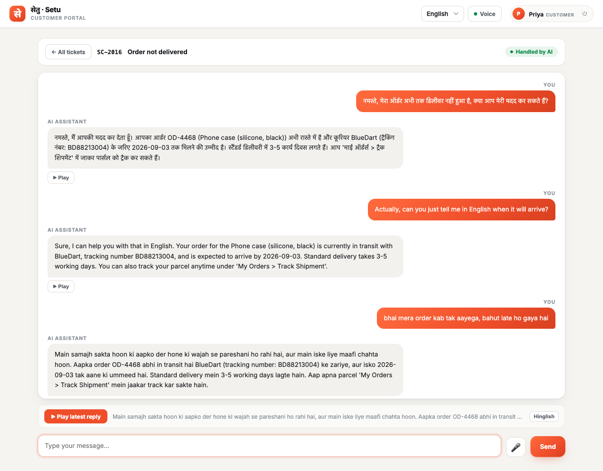
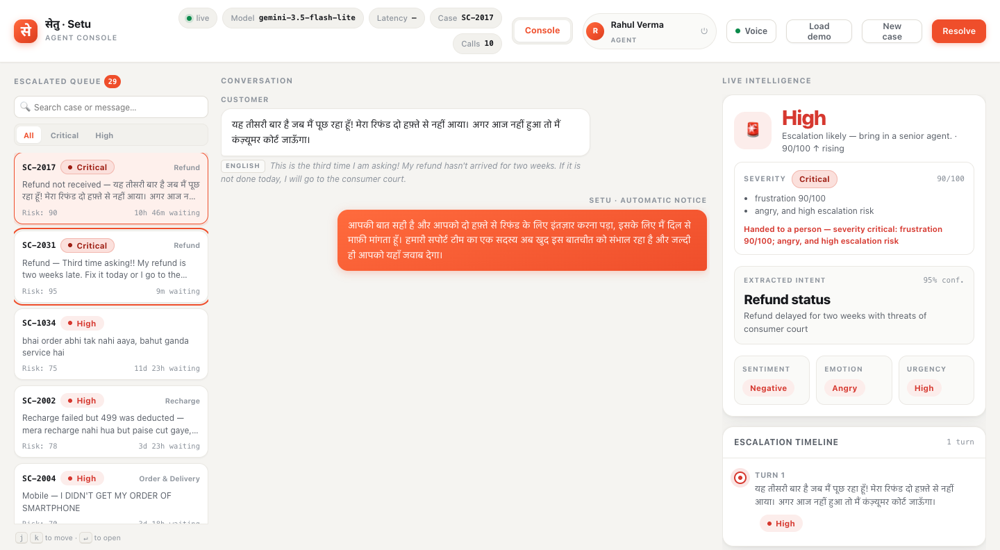
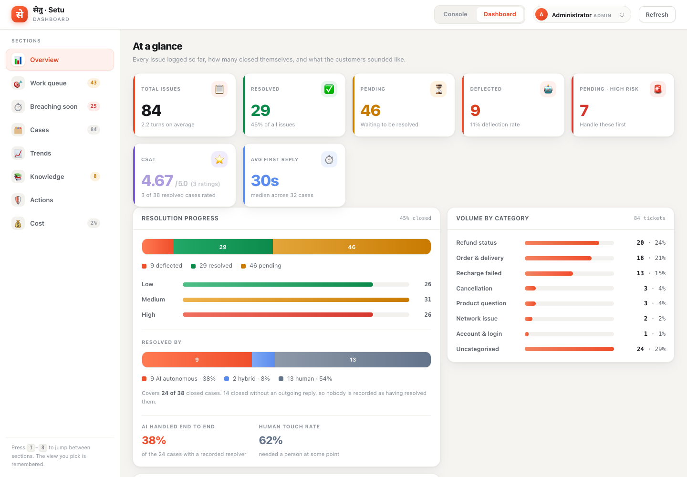
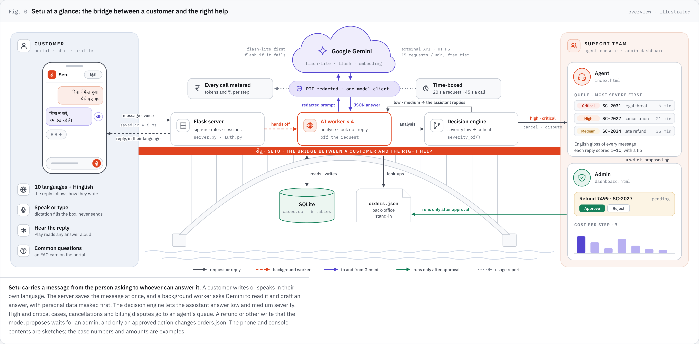

<div align="center">

<picture>
  <source media="(prefers-color-scheme: dark)" srcset="docs/images/logo-dark.svg">
  
</picture>

### AI where it's safe. Human where it matters.

**सेतु** (*setu*) is Hindi for **bridge** — which is the whole job: carrying a
customer across to an answer, and carrying them to a person the moment a
machine should not be the one deciding.

[](https://github.com/AmanKumar-23/setu/actions/workflows/ci.yml)
[](https://www.python.org/)
[](LICENSE)
[](https://ai.google.dev/)
[](app/languages.py)
[](https://docs.astral.sh/ruff/)

**Answers customers in their own language · Reads every message for risk · Hands the hard ones to a person · Coaches the agent who picks them up**

[See it](#see-it) · [Why this exists](#why-this-exists) · [Quick start](#quick-start) · [Architecture](#architecture) · [Roadmap](#roadmap)

</div>

---

## See it

<table>
<tr>
<td width="50%" valign="top">

<p align="center"><sub><b>Customer portal</b> — the assistant answers in Hindi, English or Hinglish, whichever the customer just wrote, and <b>▶ Play</b> reads any reply aloud.</sub></p>
</td>
<td width="50%" valign="top">

<p align="center"><sub><b>Agent console</b> — a Hindi threat of consumer court, read as <b>Critical</b>, handed to a person, with the English gloss beside it.</sub></p>
</td>
</tr>
</table>


<p align="center"><sub><b>Admin dashboard</b> — who resolved what (AI · hybrid · human), CSAT, first-reply time and volume by category, across eight sections.</sub></p>

---

## Why this exists

Off-the-shelf sentiment analysis is measurably wrong on Hinglish, and that is not a rounding
error — it is the difference between catching an angry customer and ignoring them.

Give a standard multilingual sentiment model this line, typed by a customer who is plainly furious:

```
bahut ganda service hai
```

> **`POSITIVE` — confidence 49.8%**

The customer said "the service is very bad." The model called it positive. An escalation tracker
built on that signal stays green while the customer walks away.

The same sentence, read by this project's Gemini-backed analyser **with the conversation around it**:

> **`negative` · frustration 85/100 · escalation risk `high`**

That gap is the whole project. Both results are reproduced, with their outputs saved, in
[`customer_support_coach.ipynb`](customer_support_coach.ipynb) — Step 13 (English) and Step 17
(Hinglish). The tracker was never the problem. **The signal was.**

---

## What it does

Three workspaces behind one sign-in, and one pipeline behind all three.

| | For | What happens |
|---|---|---|
| 🧑 **Customer portal** | customers | Raise a ticket from 14 issue tags or in your own words, chat in any of ten languages or Hinglish, dictate instead of typing, hear any reply read aloud, rate the outcome. The interface itself switches language in place. |
| 🎧 **Agent console** | agents | An escalated queue ordered most severe first, the live intelligence panel, an English gloss under any message in another script, a drafted reply, and a scorecard on every reply sent. |
| 📊 **Admin dashboard** | admins | Eight sections — overview, work queue, SLA, cases, trends, knowledge gaps, the write-action audit trail and cost — with CSV and JSON export. |

And underneath:

| | |
|---|---|
| ⚡ **Replies without the wait** | The request saves the message and returns in about **6 ms**; the model works on a background pool of four workers. A message sent mid-reply is merged, never lost. |
| 🌐 **Ten languages + Hinglish** | The reply language is detected **per message** — script, Hindi/Marathi marker words, a Hinglish word list — so a customer who switches is answered in what they just used. Analysis stays in English for the dashboard. |
| 🎯 **Conversation-aware analysis** | Intent (11 kinds, with a confidence), sentiment, six emotions, urgency, escalation risk and a 0–100 frustration score, judged over the **whole thread** as schema-checked JSON. |
| 🚦 **Four-level severity** | Low · Medium · High · Critical, computed from those readings plus threat words ("consumer court", "police"), each level carrying the rule that produced it. High and Critical go to a person. |
| 🙋 **A person when it matters** | Cancellations, billing disputes and any proposed refund always reach a human; the customer gets a handoff note in their language, and the case joins the queue. |
| 🔒 **Write-action gate** | Refunds, expedites and account resets are **proposed, never run**. An admin approves each one, and every decision is recorded. |
| 🔎 **Real back-office look-ups** | Gemini function calling against a mock order system, so a reply quotes `RF-9012, expected by 5 Sep`, not "we're looking into it." |
| 📚 **Semantic knowledge base** | Gemini embeddings with a keyword fallback. A strong match (≥ `0.65`) on a calm case is answered and closed; a miss is logged as a knowledge gap for someone to write up. |
| 🛡️ **PII redaction** | Phone numbers, emails, order ids and card numbers become placeholders *before* anything reaches Gemini — chat **and** embeddings — and are restored in the reply. |
| 🧭 **Live coaching** | Every agent reply is scored 1–10 for tone, empathy and clarity, with one specific coaching tip. |
| ⏱️ **Bounded, resilient calls** | Retries with backoff, model fallback, 20 s per request and a 45 s ceiling per call. When Gemini is unreachable the case goes to a person — nobody sees a raw error. |
| 💰 **Cost metering** | Every call's tokens, attributed to a case, an agent and a step, priced in rupees, with daily caps that refuse work rather than run up a bill. |

---

## Quick start

> **Prerequisites:** Python 3.11+ and a free [Gemini API key](https://aistudio.google.com/apikey)
> (no credit card).

```bash
git clone https://github.com/AmanKumar-23/setu.git
cd setu

python3 -m venv .venv && source .venv/bin/activate   # Windows: .venv\Scripts\activate
pip install -r requirements.txt

printf 'GEMINI_API_KEY=\n' > gemini_api_key.txt   # then paste your key after the "="
cp orders.example.json orders.json                   # the mock order system

python3 app/server.py
```

Open **<http://127.0.0.1:5001>**. On the first run the server creates an **admin** account and
prints its password once — copy it before the banner scrolls away. It also seeds two demo
accounts that the login page's one-click buttons use:

| Account | Role | Lands in |
|---|---|---|
| `priya@support-coach.local` | customer | the portal |
| `rahul@support-coach.local` | agent | the console |

Both use the demo password `support-coach-demo` (set `DEMO_PASSWORD` to change it).

<details>
<summary><b>Running the notebook instead</b></summary>

The notebook is the source of truth for the coaching engine and carries the full write-up —
the Hinglish finding, the threshold measurements and the before/after comparisons.

```bash
pip install -r requirements-dev.txt jupyter
jupyter notebook customer_support_coach.ipynb
```

Run the cells in order; Step 1 installs `transformers` and `torch` itself. It also runs in
Google Colab, where the key is read from Colab secrets.
</details>

<details>
<summary><b>The port is already in use</b></summary>

```bash
PORT=8080 python3 app/server.py
```
</details>

---

## Architecture



One Flask process serves the three workspaces. A background worker pool does all the model work,
so a customer never waits on it. Every model call leaves through **one client** that redacts
personal data first, retries, stays inside a time limit and is metered.

| Diagram | |
|---|---|
| [Containers and the calls between them](docs/architecture/fig1-containers.png) | every page, route group, service and AI function |
| [One customer message, end to end](docs/architecture/fig2-message-lifecycle.png) | the 13 steps, and the ≈ 6 ms the customer actually waits |
| [Who answers a message](docs/architecture/fig3-who-answers.png) | the decision flow and the severity scale |
| [Guarantees and where they are enforced](docs/architecture/table1-guarantees.png) | ten guarantees, each with the function that holds it |

The written walkthrough — request flow, resilience, storage, access control and metering — is in
**[docs/architecture.md](docs/architecture.md)**.

> [!IMPORTANT]
> **`app/coach_core.py` is generated. Do not edit it by hand.**
> Change the notebook, then run `python3 app/build_core.py`. CI regenerates the file and fails
> the build if it differs from what was committed, so the notebook and the app can never
> quietly disagree.

### Project layout

```
.
├── customer_support_coach.ipynb   # source of truth: engine + the written analysis
├── app/
│   ├── build_core.py              # notebook  ──►  coach_core.py
│   ├── coach_core.py              # GENERATED — AICoach, knowledge base, redaction, tools
│   ├── pipeline.py                # the one customer turn: analyse, decide, answer or hand over
│   ├── languages.py               # ten languages + Hinglish, per-message detection
│   ├── actions.py                 # the write-action gate and its audit trail
│   ├── auth.py                    # accounts, roles, sessions, lockout
│   ├── metering.py                # token counting, pricing, daily caps
│   ├── server.py                  # Flask: routes, SLA, analytics, SQLite store
│   └── static/
│       ├── login.html             # sign in, sign up, demo accounts
│       ├── portal.html            # customer: tickets, issue tags, FAQ
│       ├── portal-chat.html       # customer: one conversation
│       ├── profile.html           # customer: details and password
│       ├── index.html             # agent console
│       ├── dashboard.html         # admin dashboard
│       ├── i18n.js                # UI catalogue, switched in place
│       └── voice.js               # speech recognition and playback
├── tests/                         # pytest — runs with NO API key and no network
├── docs/                          # architecture walkthrough, diagrams, screenshots
├── .github/workflows/ci.yml       # tests · lint · notebook sync · secret scan
└── orders.example.json            # copy to orders.json
```

---

## Configuration

The API key is resolved in this order — the first one found wins.

| # | Source | How to set it |
|---|---|---|
| 1 | Environment variable | `export GEMINI_API_KEY="..."` |
| 2 | Key file | `gemini_api_key.txt` (also accepts `gemini_key.txt`, `api_key.txt`, `.env`) |
| 3 | Colab secret | Add `GEMINI_API_KEY` in the Colab sidebar |
| 4 | Prompt | Typed in when nothing else is found |

### Environment variables

| Variable | Default | What it does |
|---|---|---|
| `GEMINI_API_KEY` | — | Your key. **Never commit it.** |
| `GEMINI_MODEL` | `gemini-3.5-flash-lite` | Generation model. Falls back to `gemini-3.5-flash` when it is busy. |
| `GEMINI_EMBED_MODEL` | `gemini-embedding-001` | Embeddings for the knowledge base. |
| `PORT` | `5001` | Port for the Flask app. |
| `SECRET_KEY` | generated | Signs session cookies. Generated once and kept in the database, so a restart does not sign everyone out. |
| `ADMIN_USERNAME` · `ADMIN_EMAIL` | `admin` · `admin@support-coach.local` | The first account, created on first boot only. |
| `ADMIN_PASSWORD` | generated | Its password. Left unset, one is generated and printed once. |
| `DEMO_PASSWORD` | `support-coach-demo` | The password of the two demo accounts. |
| `PRICE_IN_INR_PER_MTOK` | `25.0` | **Placeholder.** Rupees per million input tokens. |
| `PRICE_OUT_INR_PER_MTOK` | `75.0` | **Placeholder.** Rupees per million output tokens. |
| `PRICE_EMBED_INR_PER_MTOK` | `2.0` | **Placeholder.** Rupees per million embedding tokens. |
| `DAILY_TOKEN_CAP` | `2000000` | Tokens per day before new work is refused. `0` disables it. |
| `DAILY_COST_CAP_INR` | `200` | Spend per day before new work is refused. `0` disables it. |
| `RATE_LIMIT_CALLS_PER_MIN` | `30` | Model calls per minute, per agent. `0` disables it. |

### Tuning

These live in the code, next to a comment explaining how each number was arrived at.

| Constant | Default | Where | Meaning |
|---|---|---|---|
| `SEMANTIC_THRESHOLD` | `0.58` | `app/coach_core.py` | Cosine similarity for a help article to count as a match. True matches measured 0.596–0.711; unanswerable ones never got above 0.559. |
| `AUTO_RESOLVE_THRESHOLD` | `0.65` | `app/pipeline.py` | Match strength needed to answer and close a case with no agent at all. |
| `HIGH_FROM` · `CRITICAL_FROM` | `70` · `85` | `app/pipeline.py` | Frustration at which a message is High or Critical on its own. Calibrated on the live model. |
| `NEEDS_A_PERSON` | cancellation, billing dispute | `app/pipeline.py` | Intents that always go to a person. |
| `LOOKUP_ONLY_UNDER_S` · `BESPOKE_HANDOFF_ONLY_UNDER_S` | `25` · `35` | `app/pipeline.py` | A slow turn skips the order look-up, then the custom handoff note. |
| `REQUEST_TIMEOUT_MS` · `CALL_DEADLINE_S` | `20000` · `45` | `app/coach_core.py` | Per request, and for the whole call including retries. |
| `SLA_TARGET_MINUTES` | high 15 · medium 60 · low 240 | `app/server.py` | First-response target by escalation risk. |

---

## Accounts and roles

| Role | Can reach |
|---|---|
| `customer` | **/portal** — their own tickets and profile, and nothing else. A different audience, kept out of the console entirely |
| `agent` | The console, and the cases they own or claim |
| `admin` | Everything an agent has, plus the dashboard, the **write-action gate**, the exports and account management |

Customers can sign up from the login page. Staff accounts are created from the command line,
never through the web app — an app that can mint its own admin does not really have roles.

```bash
python3 app/server.py --list-users
python3 app/server.py --add-user meera agent
python3 app/server.py --passwd meera
python3 app/server.py --disable-user meera
python3 app/server.py --enable-user meera
```

Passwords are stored as scrypt hashes; a lost one is reset, not recovered. Five wrong passwords
park an account for fifteen minutes, and sessions last twelve hours.

---

## What it costs

Every Gemini call reports how many tokens it used. That number is captured at the one place all
calls pass through, attributed to a case, an agent and a step — analyse, look up, embed, draft,
score, translate, handoff — and priced.

**Tokens are measured and exact. Rupees are derived** from a rate table that is configuration,
not fact. The shipped rates are **placeholders**, and the dashboard labels every figure
"estimated rates" until you set the real ones. The daily caps are checked at the start of a turn,
before the model is called: a cap that only reports afterwards is not a cap.

On the Gemini free tier, the limit that bites first is 15 requests per minute per model — roughly
three customer messages a minute.

---

## Tests

The suite runs **without an API key and without the network** — anything that would call Gemini
is driven with fixed inputs or stubbed, and a guard fails any test that tries to reach the real
API. A fresh clone and a fork's pull request both run it in full.

```bash
pip install -r requirements-dev.txt
pytest tests/
```

```
519 passed, 2 skipped
```

The two skips are the semantic-search paths that need the live embeddings API; their keyword
fallback is covered. The suite spans redaction round-trips, the async reply path and its locks,
reply-language detection, severity and escalation, the write-action gate, the customer portal and
profile, the UI catalogue, what each role can and cannot reach, SLA maths, analytics, the SQLite
store and its migration, and the token metering and its ceilings.

---

## Security

- Every page and every API route is behind a login and a role. The only exception is
  `/api/health`, which tells an anonymous caller nothing beyond "the process is up".
- A customer's view of a case goes through an **allow-list serializer**: sentiment, severity,
  scores, coaching, look-ups and cost can never reach the customer, including any field added
  later.
- Passwords are scrypt hashes. Session cookies are `HttpOnly` and `SameSite=Lax`, which is what
  stands between a cookie-authenticated API and cross-site request forgery. Per-request CSRF
  tokens are the stronger answer and are on the roadmap.
- `gemini_api_key.txt`, `app/cases.db` and `orders.json` are git-ignored — they hold secrets,
  password hashes or real transcripts. The repo ships `orders.example.json` in place of the order data, and the key file is created locally.
- Customer text is redacted before it reaches Gemini, on both the chat and embeddings paths.
- Write-capable tools never fire on their own: customers' turns never carry them, an agent's
  turn can only propose one, and an admin's click is the one place a write ever runs. Every
  proposal and decision is recorded in the **Actions** audit trail.
- CI greps every commit for API-key patterns and live data files, and fails if one appears.

Found a problem? See **[SECURITY.md](SECURITY.md)**.

---

## Roadmap

- **Team routing** — send escalations to Accounts, Refunds or Technical by intent, instead of one
  shared queue.
- **A narrative handoff summary** — a short account of the conversation for the agent who takes
  over, beside the key issue and severity reasons.
- **Escalation on low confidence** — the intent confidence is already extracted; route on it,
  and on knowledge-base misses.
- **Customer history in the console** — earlier tickets and summaries for the same customer.
- **Per-request CSRF tokens**, and **scale-out** beyond a single process.

---

## Contributing

Issues and pull requests are welcome — start with **[CONTRIBUTING.md](CONTRIBUTING.md)**, which
covers the notebook-first workflow (the one rule that trips everybody up), Conventional Commits
and the branching model. Everyone is expected to follow the
**[Code of Conduct](CODE_OF_CONDUCT.md)**.

## License

[MIT](LICENSE) © Aman
